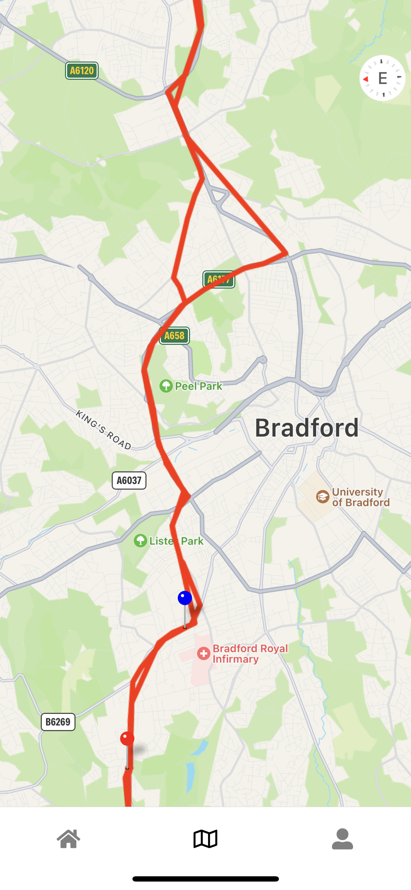

# LoRaWAN Based GPS Asset Tracking System

This is an implementation of a LoRaWAN based GPS tracking system that collects real time data from a low pwered IoT GPS tracker and displays useful data for an end user.

It is part of the submission of my final year project for my Computer Science BSc (Hons) in which I investigated the feasibility of LPWANs for a asset tracking and compared my results to current market competitors. 
## Features

- Registeration and verification of users
- Password resets
- Email address changes
- Live device dashboard
- Device nicknaming
- Device onboarding
- Device mapping including tracked journey and live markers

## Environment Variables

To run this project, you will need to add the following environment variables to your .env file

`REACT_APP_apiKey`

`REACT_APP_authDomain`

`REACT_APP_projectId`

`REACT_APP_storageBucket`

`REACT_APP_messagingSenderId`

`REACT_APP_appId`

`REACT_APP_googleMaps`

There is also a Google Maps API key which will need to be generated and added to the app.json file.

## Screenshots

## License

[MIT](https://choosealicense.com/licenses/mit/)
